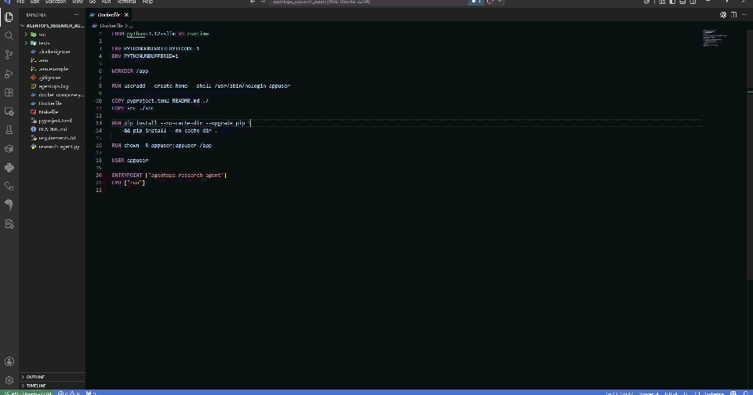

# AgentOps Research Agent

Production-oriented OpenAI research-agent example with AgentOps tracing.

## Demo



## What It Does

- Uses the OpenAI Responses API with function tools.
- Captures OpenAI calls and custom tool spans with AgentOps.
- Enforces a max-iteration guard to stop runaway loops.
- Loads secrets from environment variables, not source code.
- Ships with tests, Docker, and Compose deployment files.

## Setup

```bash
conda activate agentops_research_agent
python -m pip install --upgrade pip
python -m pip install -e ".[dev]"
```

Create `.env` from `.env.example` and set:

- `AGENTOPS_API_KEY`
- `OPENAI_API_KEY`

## Run Locally

```bash
conda activate agentops_research_agent
agentops-research-agent check-config
agentops-research-agent run --topic "AgentOps and AI agent observability in 2026"
```

You can also use the compatibility wrapper:

```bash
conda activate agentops_research_agent
python research_agent.py run
```

## Run With Docker

```bash
docker compose run --rm research-agent
```

AgentOps traces are available in the AgentOps dashboard after each run.
